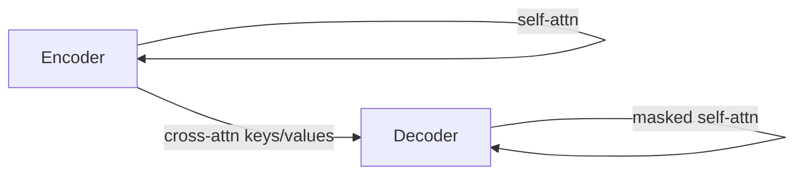

---
layout: default
title: Slide 55 — Transformer 架构与模块细节
parent: CS224N Lecture 5
grand_parent: AI Notes
nav_order: 55
---


# Slide 55 — Transformer 架构与模块细节

> 该页为第 55 页的学习笔记占位模板。请在下方补充你的要点、推导与思考。

## 关键要点（Key Ideas）
- 写出本页的核心概念、定义或结论。
- 引用与本页相关的公式、图示或伪代码。

## 公式 / 推导（可选）

```math
% 在此处使用 KaTeX/MathJax 书写公式，例如：
% \alpha_{ij} = \mathrm{softmax}_j\left(\frac{q_i^\top k_j}{\sqrt{d_k}}\right)
```


## 图表 / 流程（Mermaid 可选）




## 进一步笔记
- 结合上下文（前后页）补充联系，如与第 54–56 页的关系。

---
*提示：本文件由模板脚本自动生成；你可以直接在此页添加内容，或将多页整合为一个更完整的小节。*
